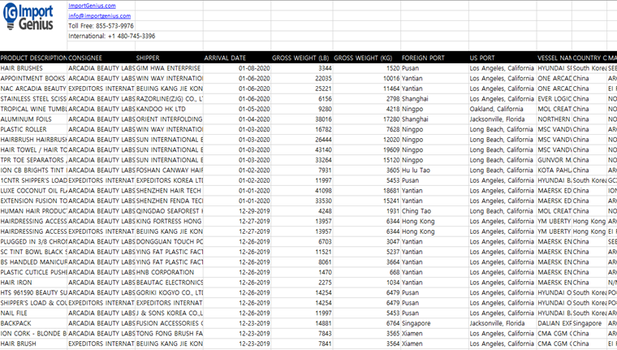
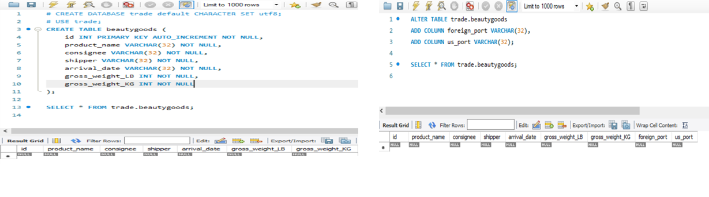
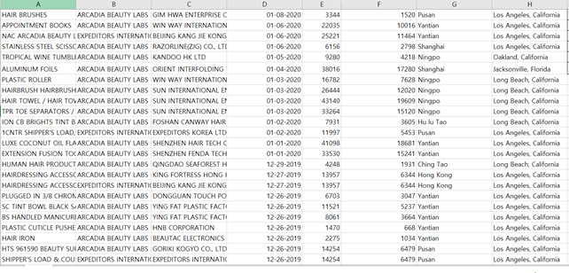
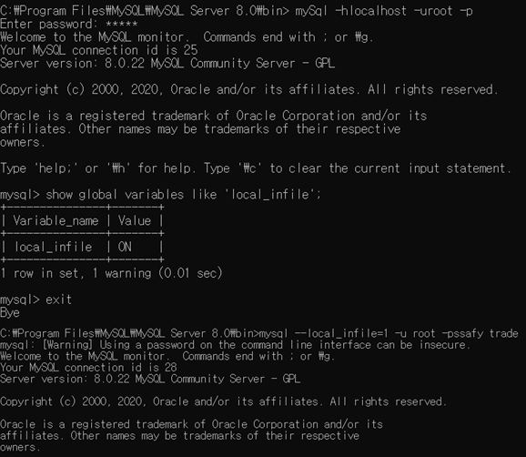
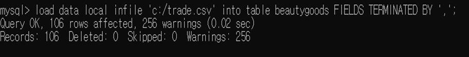
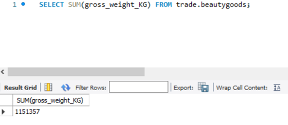
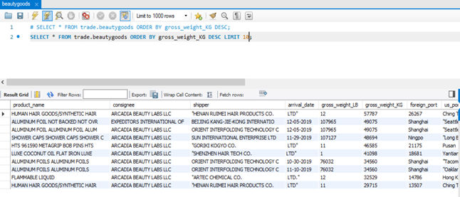
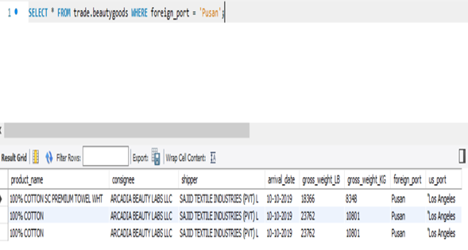
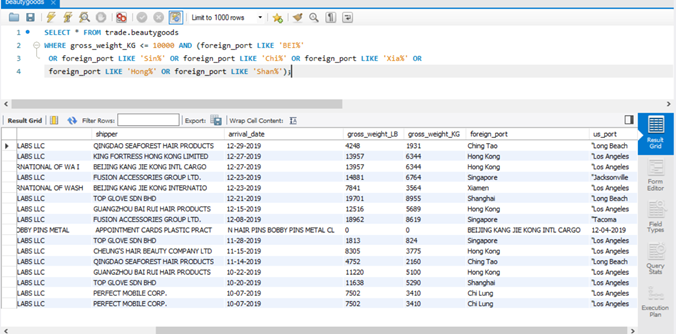
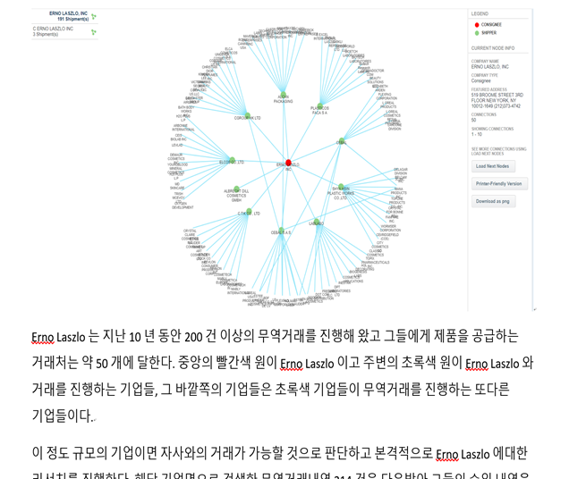

# SQL문과 미국 관세청 제공 무역 데이터를 활용한 잠재 바이어 발굴

> 해당 프로젝트 목표

- 각 국가의 무역 데이터를 SQL문을 활용해 분석하며, 새로운 거래처가 될 만한 잠재 바이어를 발굴하고자 했습니다.

## 데이터 준비하기

- 우선 미국 관세청 제공 로스앤젤레스 항만 입항 및 출항 화장품 원료(화학 원료) 선적 데이터(엑셀 파일 형태)를 받아왔습니다.

## MySQL 상에서 Excel 자료를 담을 데이터베이스와 테이블 생성

- MySQL 에서 SQL문을 이용해 데이터 베이스를 생성하고, 엑셀 데이터에서 잠재 바이어 발굴에 필요한 column 값들을 선정했습니다. 

- 이후 MySQL에서 적절한 열의 이름과 알맞은 데이터타입을 정한 후 테이블을 생성했습니다.
-  최초 테이블 생성 때 넣지 못한 필수 column들도 오른쪽과 같이 추가해줬습니다.

## MySQL에 Excel 데이터 로드작업

- MySQL에 엑셀 데이터를 원활히 로드 하기 위해서 엑셀파일 각 열의 이름을 삭제한 후 재정렬 해줬습니다.

- load data 명령어를 수행하기 앞서, "secure_file_priv“ 의 설정 때문에 바로 불러올 수 없으니 위와 같이 mysql에 설정들을 변경하며 다시 접속해 주었습니다.

- cmd 위에 mysql 서버에서 위와 같이 SQL문으로 load data를 시켜주었습니다.
  - MySQL 상에서 Column 구분 Default 값은 ',' 입니다. 때문에 엑셀 데이터에 ','가 포함 돼있다면  Column 구분자로 인식해 데이터 테이블을 생성했을 당시의 스키마보다 초과된 Column(Attributes)를 갖게 돼 정상적으로 load가 되지 않습니다. (유의)
- 엑셀 데이터 load 도중 제대로 load가 안됐을 시에는 SQL문 중에 ‘TRUNCATE’와 ‘ALTER TABLE DROP COLUMN’ 문법을 사용해 테이블 내용을 지워가며 지속적으로 시도했습니다.

## SQL을 활용한 무역데이터 분석 예시

- 미국 로스앤젤레스 항만 연간 화장품 원료 총 거래량(입항 및 출항) 확인하기.\

- 거래량 기준 내림차순으로 정렬해 거래량 최고 품목부터 최하 품목까지 확인.
- 이후 거래량 기준 상위 10개 상품과 기업 추출.

- 미국 로스앤젤레스 항만에 화장품 원료를 수출하는 한국 기업 확인

- 동 아시아권 수출국 중 자사와 비슷한 거래규모를 지닌 경쟁사 추출

> 예시와 같은 방법들로 필요와 전략에 따라 여러 SQL문을 사용하며 무역 데이터 분석과 잠재바이어 발굴을 시행해봤습니다.

### 프로젝트 종료 후 데이터 시각화 작업

- 잠재 바이어 기업의 선정 배경이 됐던 ‘SQL문 쿼리 결과 테이블’ 별로 외부 사이트(Finereport tool)를 활용해 데이터 시각화도 해봤습니다.
