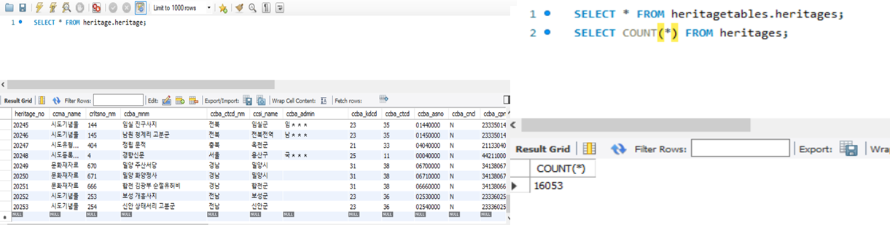
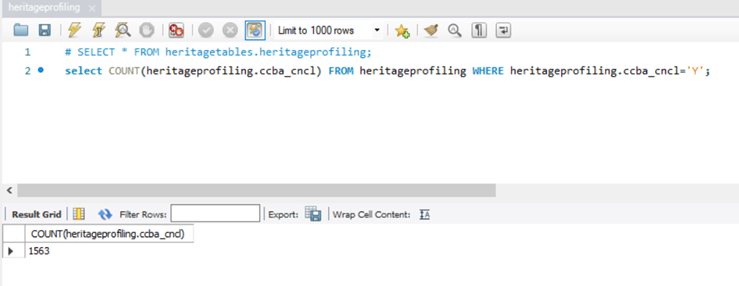
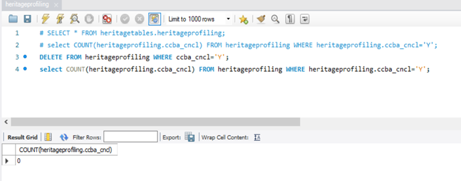
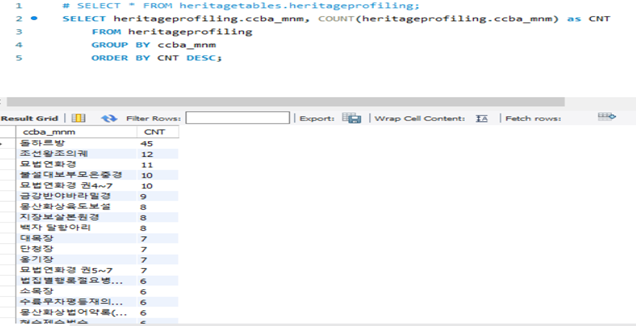
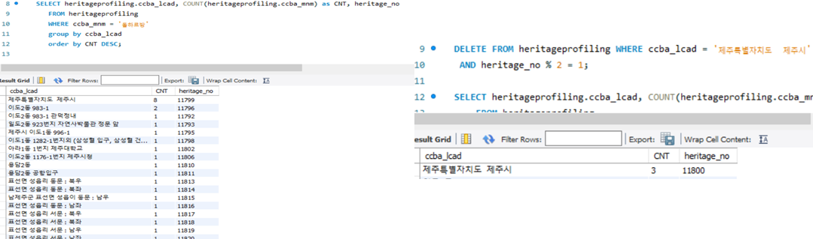
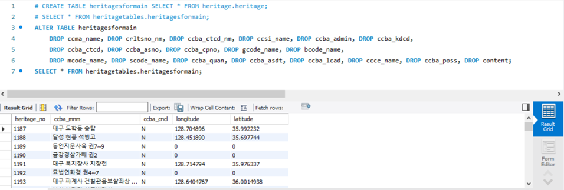

# SQL문을 활용한 문화재 데이터 검사

> 해당 프로젝트 목표

- 문화재청 제공 문화재 정보 데이터를 받아와 SQL과 데이터 프로파일링 기법을 이용해 데이터 검사 작업을 수행했습니다.
- 검증이 끝난 데이터는 프로젝트 기능 요건에 맞춰 SQL문을 사용해 axios 요청 종류에 따라 필요한 데이터 별로 가공 후, 웹 페이지의 지도 위에 정보를 등록했습니다.
- 이를 바탕으로 사용자들이 저희 웹 상의 지도 위에서 모든 한국 문화재를 탐방할 수 있도록 목표했습니다.

## 문화재 데이터 준비하기

- 문화재 데이터는 해당 Repository에 sql 파일 형태로 업로드 해 두었습니다.
- 문화재청 제공 문화재 API를 사용했습니다. 관련 자세한 사항은 [문화재청 문화재 API를 활용한 데이터 로드 Repository](https://github.com/brotherspear1994/GovernmentOpenAPI-Study) 를 참고하세요.

## SQL 파일 구조 및 형태

- MySQL 에서 총 16503개의 문화재 데이터를 조회할 수 있습니다.

- 프론트앤드 상에서 기능별(요청 종류별)로 백앤드에 여러 종류의 axios 요청을 보내게 되는데, 이러한 요청 종류를 기준으로(ex. 기본 지도 렌더링 요청) 데이터 베이스 상에서도 필요한 데이터 테이블만 따로 구축해 놓으려 했습니다. 
- 이를 위해 SQL문을 사용해 데이터를 검사하고 검증된 데이터는 가공하여 데이터 테이블을 따로 구축했습니다. 

## 데이터 프로파일링 기법을 이용한 검사 작업 예시

### 누락 값 분석

- 사용자가 마커를 마우스오버 하거나 클릭 했을 때 문화재 이미지 정보를 조회시켜주는 기능은 필수 이기 때문에 데이터 테이블에서 이미지 값 NULL 상태가 yes(‘Y‘)인 값, 즉 이미지 데이터를 갖고 있지 않은 문화재들의 개수를 조회했습니다.

- 위와 같이 DELETE 구문을 이용해 이미지 값이 누락된 문화재를 삭제해주고, 잘 삭제 됐는지 확인해줬습니다.

- 이와 같은 방법으로 문화재 데이터 중 문화재 명, 주소, 위치, 경도 등 필수 값들이 누락된 문화재들 또한 삭제해 주었습니다. Ex) DELETE FROM heritageprofiling WHERE ccba_lcad = '';

### 중복 개수 (빈도수)가 높은 문화재 조회

- 지역별로 분포된 돌하르방 개수가 많기 때문에 45개의 최대 빈도 값을 보이고 있음을 확인할 수 있습니다

- 지역명 값을 이용해 이 중 가장 많이 밀집된 지역들을 알아낸 후, 해당 지역의 돌하르방은 일정 비율로 랜덤 삭제 해주기로 하였습니다. 

### 가장 높은 빈도 값을 보인 지역의 돌하르방 일부 랜덤 삭제

- 지역 중 ‘제주특별자치도 제주시‘ 에서 가장 많은 돌하르방이 중복 됐음을 알아냈습니다.

- 오른쪽 그림과 같이 DELETE 구문을 사용해 ‘제주특별자치도 제주시＇의 일부 돌하르방만 성공적으로 랜덤 삭제 시켰음을 확인할 수 있습니다.

## 데이터 가공 예시

> 메인 페이지 로딩 시 전체 문화재 위치를 지도에 등록시키기 위한 데이터 가공

- 데이터 검사 작업을 완료한 후 데이터 테이블 가공 작업을 실시했습니다.

- 우선 위와 같이 ‘CREATE TABLE heritagesformain ~ ‘ SQL문을 사용해 가공할 데이터 테이블을 검증이 끝난 원본 데이터를 복사하며 새로 생성했습니다.
- 이후 프론트앤드 상에서 메인 페이지 로딩 시 전체 문화재 데이터를 지도에 마커 등록하기 위한 값들이 무엇인지 미리 파악한 후, 그 외 불필요한 column들은 전부 삭제했습니다.

> 위와 같이 SQL문을 이용해 데이터 검사와 테이블 가공을 완료한 후, 이를 문화재 지도에 등록시켜 주었습니다.
>
> [지도를 통한 문화재 탐방 프로젝트 상세 주소](https://github.com/brotherspear1994/KoreanHeritageTrip_PJT)